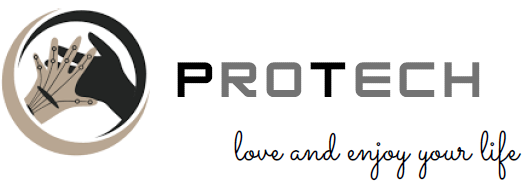
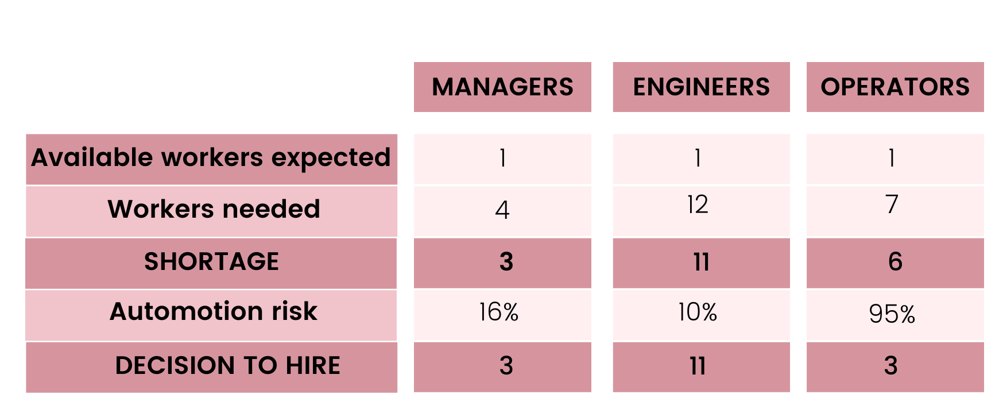
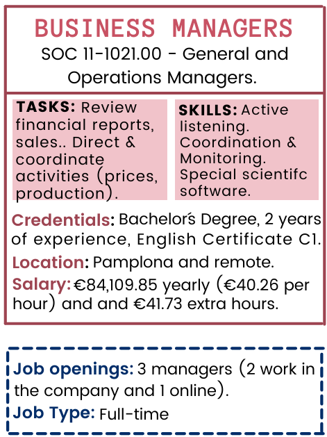
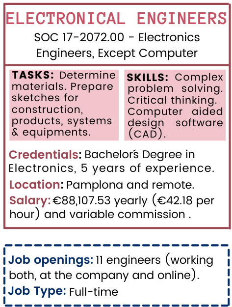
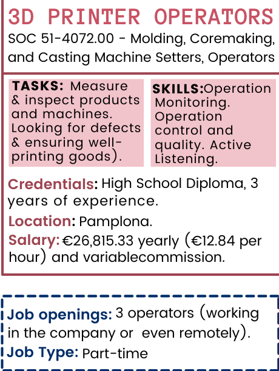

<video src="Protech..mp4" width="320" height="200" controls preload></video>

## OUR HISTORY 

ProTech is a Spanish company set in Pamplona. The company was created with the aim of giving a better quality lofe for people who have suffered physical health problems. We produce orthopedic devices, prosthetic appliances... We want people to keep dreeming, achieve their objectives and, above all, to enjoy their life.

For doing so we use 3D printers, as these machines are cheaper and more people can afford them. PreTech helps their clients to recover the happiness they experienced before.

### NAICS: 339113 - Surgical Appliance and Supplies Manufacturing ###

## PRIMARY AND SUPPORT ACTIVITIES

## FORECASTING 

## JOB POSTING 
 

 

## Love and enjoy your life 
